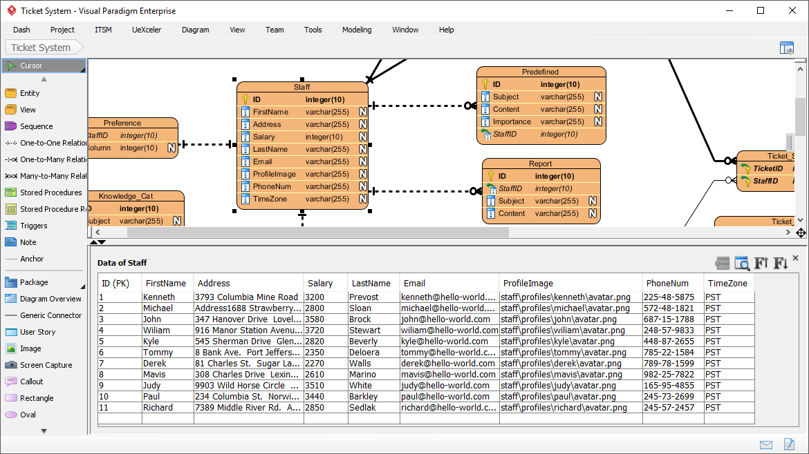

# libbitcoin-sqlite-task
This repository contains a small SQLite program in C++ for the stretch goal (libbitcoin organization, Summer of Bitcoin programme) created in 2024.

## Build and run
For the successful compilation, the ```Boost``` and ```SQLite3``` libraries are required. Then run the following commands:

Create the build directory:

```
mkdir build; cd build
```

Run cmake for configuration:

```
cmake ..
```

Compile with make by using:

```
make
```

Run the application with:
```
./app
```

## Table scheme
For the small database table scheme, the example from the official website of the [Visual Paradigm](https://www.visual-paradigm.com/features/database-design-with-erd-tools/) program was chosen. The *Staff* table structure is as follows:



The examples of the table records are taken from the same source.

## Program description

The program (created in the [main.cpp](main.cpp) source file) creates a new database in the ```dbschema.db``` file. After that, the *Staff* table is created and the example persons are inserted from the [file](people.csv) (as in the [table scheme](#table-scheme)). Then the following queries are proceed (in the same order):

- Select and print people with a salary greater or equal to 3500.
- Insert a new person. This person has the same last name as at least one person who already is stored in the table.
- Print all persons from the table which has the last name mentioned in the previous point (LastName = Sloan).
- Update the phone number for the person with a specific identifier (ID = 1).

Lastly, the table is dropped from the database and the whole database (the ```dbschema.db``` file) is deleted because of the only example purposes.

## Program output
In order to simply view the example the program output is saved in [text file](program_output.txt) created by:

```
./app > program_output.txt
```

## Code style
Because the used SQLite library functions is a C library and the original [libbitcoin database](https://github.com/libbitcoin/libbitcoin-database) is written in more a C style code too, I have decided to used this approach instead of using the [C++ style guide](https://google.github.io/styleguide/cppguide.html).

Since this is only an example application, some values are "hard-coded" in the program.
